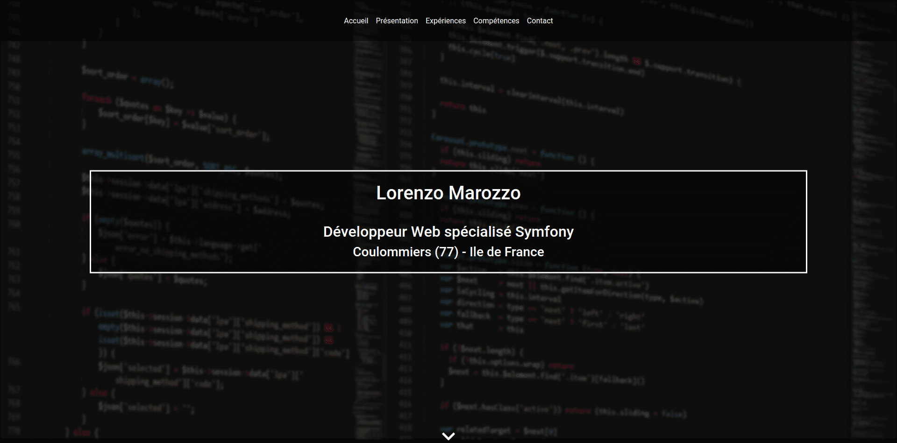

<!-- PROJECT SHIELDS -->


<!-- PROJECT LOGO -->
<p align="center">
    <a href="https://github.com/Grandpere/grandpere.github.io">
        
    </a>
    <h3 align="center">My porfolio</h3>
    <p align="center">
    Basic portfolio hosted by Github page
    <br />
    <br />
    <a href="https://grandpere.github.io/">View Demo</a>
    ·
    <a href="https://github.com/Grandpere/grandpere.github.io/issues">Report Bug</a>
    ·
    <a href="https://github.com/Grandpere/grandpere.github.io/issues">Request Feature</a>
    </p>
</p>


<!-- TABLE OF CONTENTS -->
## Table of Contents

* [About the Project](#about-the-project)
  * [Built With](#built-with)
* [Getting Started](#getting-started)
  * [Installation](#installation)
* [Roadmap](#roadmap)
* [Contact](#contact)


<!-- ABOUT THE PROJECT -->
## About The Project



The objective of this project was to develop a simple porfolio.

### Built With

* HTML5
* CSS3
* Bootstrap
* JS


<!-- GETTING STARTED -->
## Getting Started

To get a local copy up and running follow these simple steps.


### Installation
 
1. Clone this repo to your local machine using
    ```sh
    git clone https://github.com/Grandpere/grandpere.github.io.git
    ```

<!-- USAGE EXAMPLES -->

<!-- ROADMAP -->
## Roadmap

See the [open issues](https://github.com/Grandpere/grandpere.github.io/issues) for a list of proposed features (and known issues).

:construction_worker: More improvements (css animation, javascript, ...)

<!-- CONTRIBUTING -->

<!-- LICENSE -->

<!-- CONTACT -->
## Contact

[@LMarozzo](https://twitter.com/LMarozzo)


<!-- ACKNOWLEDGEMENTS -->

<!-- OTHERS -->
